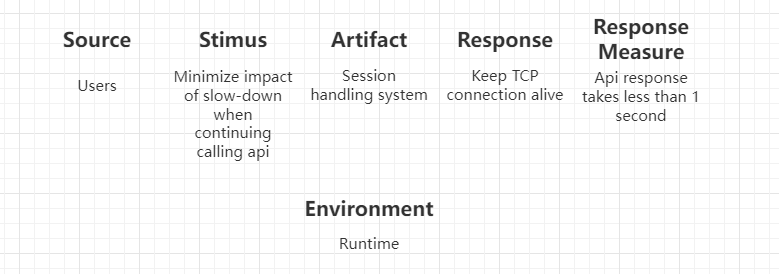
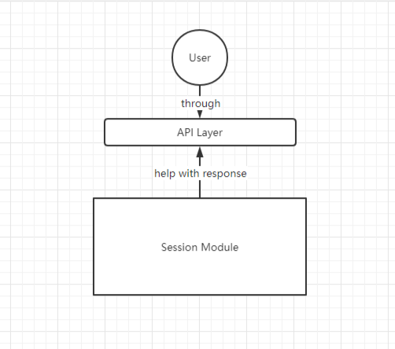
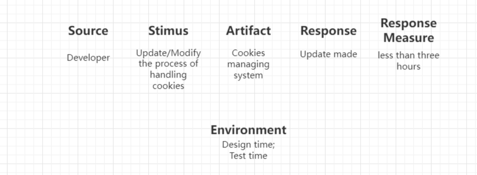
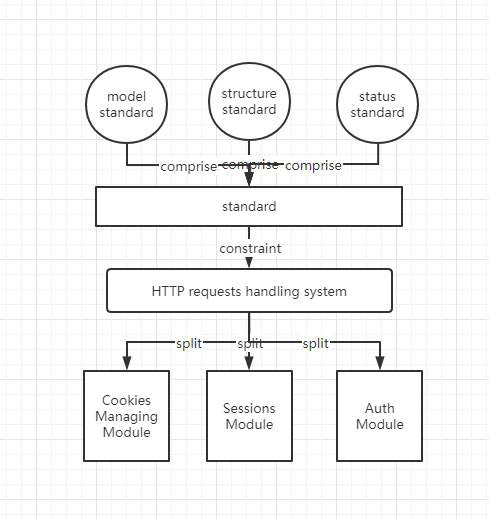
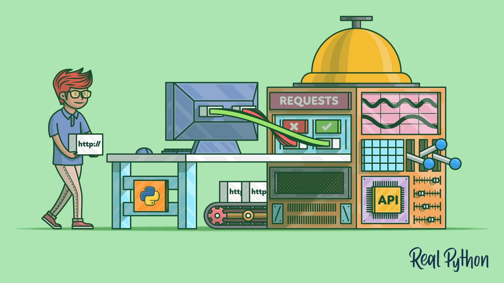
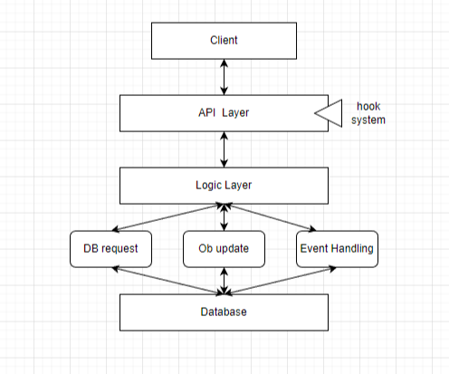
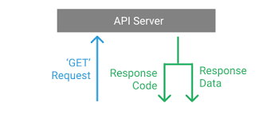
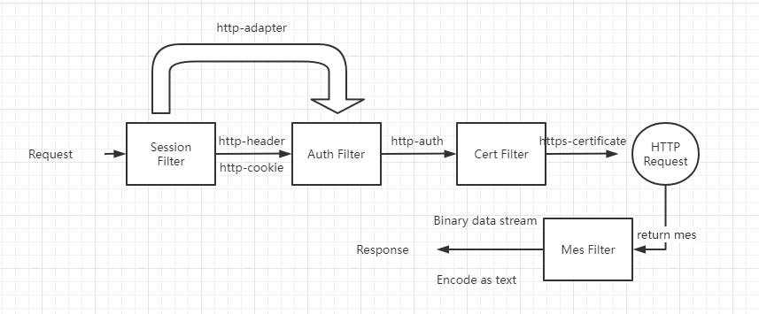

# Software Architecture Recovery of Requests

## Context

Requests is a simple, yet elegant, HTTP library written in Python that allows you to send HTTP/1.1 requests extremely easily. It is one of the most downloaded Python packages. Requests officially supports Python 3.7+, and runs great on PyPy.

### Technical Context

#### Usability

When a large file is requested to be transferred, the traditional python library may not be transferred successfully. When the server communicates with the client, too long communication time will cause the cookie to expire and disconnect, or the sent request header which is too long would make the received information incomplete.

#### Augmentability

When a large number of http requests are sent and need to be processed separately, the broken api of the traditional python library would cause the code and structure too complicated to understand.

#### Environment

##### Certifi CA Bundle

Certifi is a carefully curated collection of Root Certificates for validating the trustworthiness of SSL certificates while verifying the identity of TLS hosts. It has been extracted from the Requests project.

##### CacheControl

CacheControl is an extension that adds a full HTTP cache to Requests. This makes your web requests substantially more efficient, and should be used whenever you’re making a lot of web requests.

##### Requests-Toolbelt

Requests-Toolbelt is a collection of utilities that some users of Requests may desire, but do not belong in Requests proper. This library is actively maintained by members of the Requests core team, and reflects the functionality most requested by users within the community.

##### Requests-Threads

Requests-Threads is a Requests session that returns the amazing Twisted’s awaitable Deferreds instead of Response objects. This allows the use of async/await keyword usage on Python 3, or Twisted’s style of programming, if desired.

##### Requests-OAuthlib

Requests-oauthlib makes it possible to do the OAuth dance from Requests automatically. This is useful for the large number of websites that use OAuth to provide authentication. It also provides a lot of tweaks that handle ways that specific OAuth providers differ from the standard specifications.

##### Betamax

Betamax records your HTTP interactions so the NSA does not have to. A VCR imitation designed only for Python-Requests.


## Key StakeHolders

### Business Manager

Responsible for the functioning of the business/organizational entity that owns the system. Includes managerial/executive responsibility, responsibility for defining business processes, etc.

#### Concerns:

* Requests should be simpler and easier to use and understand than other Python modules for sending HTTP requests.
* Requests should be open.

### Integrator

Responsible for taking individual components and integrating them, according to the architecture and system designs.

#### Concerns:

* Each components or parts of Requests should be neat and clear.

### Customer

Pays for the system and ensures its delivery. The customer often speaks for or represents the end user, especially in a government acquisition context.

#### Concerns:

* Requests should be easy to use and have exhaustive documentation for guiding.
* Requests should be stable and not changes often.

## Features

### Request

The python requests library has easy to use methods available to handle Http request. Passing of parameters and handling the request type like GET, POST, PUT, DELETE, etc. is very easy.

### Response

You can get the response in the format you need and the supported ones are text format, binary response, json response, and raw response.

### Headers

The library allows you to read, update or send new headers as per your requirements.

### Timeouts

Timeouts can be easily added to the URL you are requesting using python requests library. It so happens that you are using a third-party URL and waiting for a response.
It is always a good practice to give a timeout on the URL as we might want the URL to respond within that timeout with a response or an error that is coming because of timeout. Not doing so can cause either to wait on that request indefinitely.

### Error handling

The requests module gives support for error handling and some of which are Connection Error, Timeout errors, TooManyRedirects, Response.raise_for_status errors, etc.

### Cookies

The library allows you to read, write and update for the requested URL.

### Sessions

To maintain the data, you require between requests you need sessions. So, if the same host is called again and again you can re-use the TCP connection which in turn will improve the performance.

### SSL certificates

SSL certificate is a security feature that comes with secure urls. When you use Requests, it also verifies SSL certificates for the https URL given. SSL Verification is enabled by default in the requests library and will throw an error if the certificate is not present.

### Authentication

HTTP authentication is on the server-side asking for some authentication information like username, password when the client requests a URL. This is an additional security for the request and the response being exchanged between the client and the server.

## Quality Attributes

### Usability

Requests is designed to be the simplest way possible to make http calls. It supports HTTPS and follows redirects by default. It abstracts the complexities of making requests behind a beautiful, simple API.

```python
>>> import requests
>>> r = requests.get('https://httpbin.org/basic-auth/user/pass', auth=('user', 'pass'))
>>> r.status_code
200
>>> r.headers['content-type']
'application/json; charset=utf8'
>>> r.encoding
'utf-8'
>>> r.text
'{"authenticated": true, ...'
>>> r.json()
{'authenticated': True, ...}
```

### Performance

Requests supports streaming uploads, which allow you to send large streams or files without reading them into memory and thanks to urllib3, keep-alive is 100% automatic within a session which improve performance.

### Security

The security is also taken care of the help of authentication module support.When makeing request, the request is made to the URL given and it could be a secure or non-secure URL.

## Key Drivers

### Usability

Requests is designed to be the simplest way possible to make http calls which is easy to get started.

#### Scenario
    Source: Users
    Stimus: Minimize impact of slow-down when continuing calling api
    Artifact: Session handling system
    Environment: Runtime
    Response: Keep TCP connection alive
    Response Measure: Api response takes less than 1 second



#### Tactics

```
Keep-alive: Python requests are basically requests based on the TCP protocol. In order to keep the return speed when users call the API constantly, python requests provide a Session module to maintain the TCP connection.
```



### Modifiability

Requests welcomes other contributors to update or advance content. It can be smoothly updated and problem solved.

#### Scenario
    Source: Developer
    Stimus: Update/Modify the process of handling cookies
    Artifact: Cookies managing system
    Environment: Design time; Test time
    Response: Update made
    Response Measure: less than three hours



#### Tactics

```
Split Module: Requests divide the process of handling a http request into Session Module, Cookies Module, Auth Module, etc. 
Requests divide the standard part into Models Module, Structure Module, Status_Code Module, etc. When making new modifications, the effort could be low.
```



## Earliest Design Decisions


* To lead the whole of our project, Requests should be BDFL(Benevolent Dictator For Life), which when other contributors make contribution to the project, founders will consolidate all resources to build up requests.
* To make it more convenient for our customers to use the library, Requests should be able to supports Python 2.6-2.7 and 3.x, and can should perfectly in PyPy. These editions are the most used today.
* Requests should be usability, which we should insert a hook system in the project. It has a hook system that you can use to manipulate portions of the request process, or signal event handling. This process often has many steps. These hook functions are often mounted in these steps to provide flexibility for adding additional operations. However, it may be hard to prepare and write.

* Requests should be simple to use, which we should encapsulate the http methods one by one in the API. It may be cockamamie to realise but benifit the structure of our code.  



## Architectural Pattern

### Pipe & Filter Pattern

Each stage will process the request. If the request passes, it will be passed to the next processing, and if it fails, the corresponding HTTP response will be returned. When creating a Request object, the session will be initialized, the default http header and http cookie information will be created, and the HTTPAdpater object will be created. After that, http verification and https certificate processing will be performed in the Auth model and Cert model, respectively. The request object will be added with the corresponding verification results, and finally the Response object will be formed. Binary data and the corresponding encoded text will be reserved respectively.


